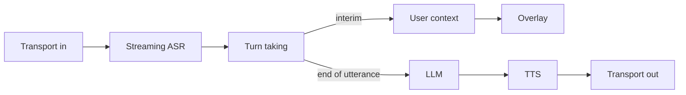

# Audio processing

How a spoken request moves from the microphone to a reply. The stages are transport in, streaming ASR, turn taking, user context, the LLM, TTS, and transport out. The [NeMo Labs Voice Agent](https://docs.nvidia.com/nemo/labs-voice-agent/nemo-voice-agent/nemo_voice_agent/pipecat/services/nemo/builders/) is a useful read for the same pipeline.

This is the assistant listen path, with the rest of the session in [flow.md](flow.md). F9 dictation stays on Voxtype and is not part of this path.

## Transport in

One capture reads the default microphone at 16 kHz, one channel, 16-bit. That is the format the streaming ASR model expects. A second capture is not opened to decide when the person has stopped. If the orb still grows and shrinks with the voice, that meter must not start or stop a request.

Voxtype is not in this capture. Dictation keeps its own file interface. The assistant does not start, stop, or cancel a Voxtype recording.

## Streaming ASR

The model is [Parakeet-Realtime-EOU-120M](https://huggingface.co/nvidia/parakeet_realtime_eou_120m-v1), a cache-aware streaming FastConformer with an RNN-T decoder, about 120 million parameters. Audio arrives in short chunks while the person is still talking. The encoder keeps a cache, so each chunk continues the sentence instead of re-reading it from the start. The attention context shipped with the model is 70 frames of the past and 1 frame of lookahead, about 80 ms. The model card states a design latency of 80–160 ms. On its end-of-utterance test the median delay is 160 ms and the 90th percentile is 280 ms.

The device is configurable. The default is CPU. When the config selects GPU and an NVIDIA GPU is present, the same model runs there. The cache-aware ONNX used here steps 128 mel frames at a time, about 1.28 seconds. Partials update on that step. The 80–160 ms figure above is the model's attention lookahead, from the model card.

Each step returns the current hypothesis. Until an end marker appears, that text replaces the previous partial on the overlay. It is not a new conversation turn. That rule is already in [ui-design.md](ui-design.md).

The model uses two markers:

- **End of utterance.** The person has finished and a reply is due. Turn taking commits the line and the recognizer cache for that stream is cleared.
- **End of boundary.** A pause, or a short acknowledgement such as “uh-huh,” rather than the end of the request. The overlay updates and the request stays unsent.

The official checkpoint is English and does not emit punctuation or capitals.

## Turn taking

Turn taking is the only stage that may decide the user has finished. It reads the streaming ASR output.

- An interim hypothesis is written to user context as a partial transcript. The overlay shows it. The LLM is not called.
- An end-of-utterance marker, or the Enter key, commits the current line. That line is the user text for one turn.
- Escape drops the stream, clears the hypothesis, and does not commit.
- An end-of-boundary marker does not commit.

Nothing else in the listen session may commit a turn. If the end-of-utterance token is late or missing, that is something to measure. It is not a reason to put the 900 ms timer back in front of the model.

## User context

Until the turn is committed, the line is provisional. The snapshot stores it as a partial with `final` false. The orchestrator may hold that growing text. On commit, `final` becomes true and that text is the user message.

The LLM sees the finished sentence. It does not see the audio, and it does not see earlier drafts.

## LLM

This stage starts only after turn taking commits. It is the current tool loop.

The router picks at most two tool heads from the finished sentence. Qwen, on llama-server, sees only those tools. The allowlist runs locally. The spoken reply is one or two sentences, without filesystem paths. Nothing here runs on a partial.

## TTS

Kokoro speaks the finished reply. If it cannot, eSpeak does. If that cannot, a notification does. Escape stops playback. TTS is not asked to speak before the tools run. The partial line on the overlay is the acknowledgement.

## Transport out

The speakers play the reply. The overlay shows the partial during recognition, then the tool results, then the reply.

## What this removes

The previous assistant ear was a parallel `parec` tap. It waited 900 ms of quiet after at least 250 ms of speech, ignored the first 300 ms, and reset after 5 s of silence without ending the session. Those numbers existed because recognition started only after the recording stopped. This loop removes them from the assistant path, along with the Silero gate and the long transcribing wait.
