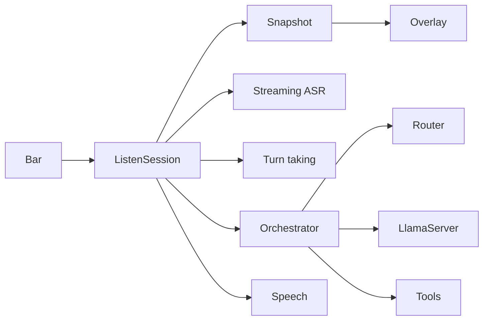
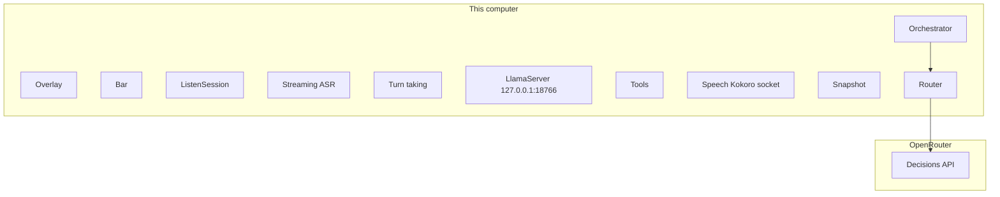
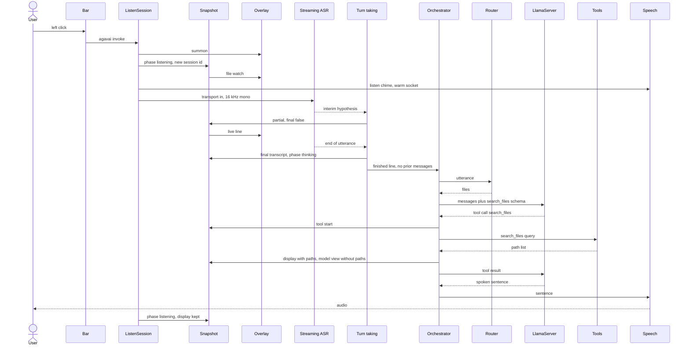
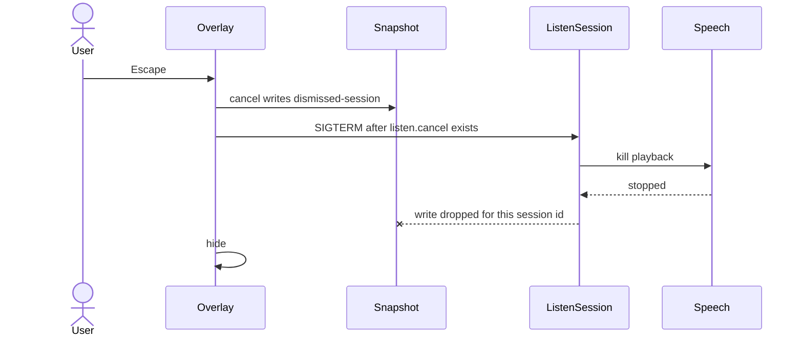

# Agavai voice loop

Design spec for the voice loop. Audio stages are in [audio.md](audio.md). The assistant listen path follows this spec: streaming ASR, then end of utterance, then the existing tool loop. Visual layout stays in [ui-design.md](ui-design.md). Model selection and the full config key list stay in [architecture.md](architecture.md) and [share/config.example.toml](share/config.example.toml).

This file wins on runtime behavior where those documents disagree. [architecture.md](architecture.md) still describes a GTK window, a Super+Ctrl+M toggle, and a two-second grace window. [README.md](README.md) says v1 talks to no remote model. None of those three claims match the code. The surface is the Quickshell overlay. Super+M starts a session that stays listening. Head selection may call OpenRouter.

## Requirements

Agavai is a local Omarchy assistant for one person at the machine.

- One overlay. The launcher, Super+M, Super+Ctrl+M, and the bar icon open `janar.agavai`. Invoking again while a request is active raises that overlay and does not restart capture.
- Speak, and the words appear while you are still talking. The utterance is sent when streaming ASR emits end of utterance. A second shortcut press is not required. Enter sends the current line immediately. Escape dismisses.
- The overlay stays up after a turn, with the results still visible, and listens for the next utterance. A new session, after the previous process has exited, starts blank.
- The reply is one or two short spoken sentences. Richer content (files, images, lists) is on screen. Spoken lines use names, not filesystem paths.
- Desktop actions go through an allowlist. There is no generic shell. The model may claim a change only after a tool result says it happened.
- Interim text from streaming ASR is shown on the overlay and is not a turn. The finished line, after end of utterance or Enter, is the only user text the LLM sees. Partials are replaced when the hypothesis changes. [ui-design.md](ui-design.md) already states that rule.
- F9 dictation stays on Voxtype. The assistant does not start, stop, or cancel a Voxtype recording. The two still must not use the microphone at the same time. Agavai does not enforce that lock.
- The brain is an on-device GGUF. Tool execution stays on the machine. The exception is the default router, which may send the utterance to OpenRouter Jev.

These are current tuning knobs, not separate service targets. Defaults are in [share/config.example.toml](share/config.example.toml).

| Knob | Default | What it changes |
|---|---|---|
| Streaming ASR device | CPU | GPU when the config selects GPU and an NVIDIA GPU is present |
| `[router] timeout_secs` | 2 s | Cap on the Jev call |
| `[router] max_tools` | 8 | Schemas injected into one completion |
| `[llm] max_tool_rounds` | 6 | Tool loop cap |
| `[llm] timeout_secs` | 120 s | Cap on one llama-server call |
| `[llm] max_tokens` | 512 | Cap on one completion |

No end-to-end latency target is written down. The 120 s llama timeout is the failure bound, not the hoped-for reply time.

## High-level design

ListenSession is one process. It owns the microphone, writes Snapshot, and calls the others. Overlay and Bar only watch Snapshot and run CLI commands. Orchestrator is a function inside ListenSession, not its own process.

There are no containers. Voxtype’s sanitizer on port 18765 is a third llama-server and is not in the diagram. The assistant never calls it. Dictation still uses the Voxtype daemon.

### Decisions

**One overlay, not a second window.** [ui-design.md](ui-design.md) rejects a GTK window: the launcher is an invocation of the same Quickshell layer. A separate window would still work if the layer failed to appear, which is what [architecture.md](architecture.md) still describes, and it would split focus, results, and cancel across two surfaces. The choice stands only while the Omarchy shell can summon `janar.agavai`. If summon fails, ListenSession is not started.

**One process per session, not a resident agent.** ListenSession exits when the user dismisses it, capture fails, or the mic stream ends. A daemon could keep the model transcript across dismissals. It would also hold the microphone and race F9. The transcript lives in that process only. Assumption: a follow-up happens before dismiss. After exit, the next invoke is a blank session.

**Assistant GGUF, not the dictation sanitizer.** `agavai-llm` loads the configured GGUF on port 18766, in its own user-service cgroup. Port 18765 is Voxtype’s smaller cleanup model. Reusing it would couple assistant restarts to `systemctl restart voxtype`, which [architecture.md](architecture.md) calls out as a hang. Assumption: the selected GGUF emits OpenAI tool calls or Qwen `<tool_call>` JSON. Default `n_gpu_layers = 0` runs that model on CPU. That setting is independent of the streaming ASR device.

**Heads, not the full tool list.** [architecture.md](architecture.md) says the full set is about thirty schemas and about 1.7k tokens, which does not fit a 4B’s useful budget. Jev answers one typed choice (“which head?”). Keyword overlap is the offline path. A local decision model is the same `select()` contract and today runs the keyword router. Keyword-only stays on the machine and matches only the words listed on each head. Jev with `fallback = "none"` returns no tools when the key is missing or the call fails. The chosen path is Jev, then keyword. Assumption: two heads and eight schemas are enough for one utterance. A successful Jev answer of `chat` is not final: if keywords still match a head, those heads are attached anyway.

**In-process tools, not MCP inside the turn.** The voice loop calls `DISPATCH` directly so the 4B does not speak a second protocol. `agavai mcp` exposes the same functions for other clients. Putting MCP on the voice path would add a stdio hop and a second schema encoding without changing what can run. Assumption: every desktop action the model needs is already a named function.

**Streaming ASR, not a file transcript.** Transport in is one 16 kHz mono capture. [Parakeet-Realtime-EOU-120M](https://huggingface.co/nvidia/parakeet_realtime_eou_120m-v1) emits text while audio is still arriving. Interim hypotheses update user context and the overlay. They are not turns. End of utterance commits the line. End of boundary does not. The device defaults to CPU. When the config selects GPU and an NVIDIA GPU is present, the same model runs there. Detail is in [audio.md](audio.md). Voxtype’s file API stays on F9 dictation only. `ChatUi.partial` is the snapshot write for an interim line.

**Turn taking from the recognizer, not a silence timer.** The 900 ms quiet window, the 250 ms minimum, the 5 s reset, the 300 ms lead-in, the energy gate, and Silero are not on the assistant path. A second `parec` tap must not decide the turn. Enter commits the current hypothesis. Escape drops it. The LLM, including the router, does not run on a partial.

**Stay listening after every completed turn.** The session returns to the microphone with the canvas kept. `wants_followup` is not consulted. A policy that reopened the mic only for questions would drop the “still listening” behavior [ui-design.md](ui-design.md) describes. Assumption: the user dismisses with Escape when they are done. An end of utterance with no words is not a turn, so it does not continue the stored messages.

### How it fails

| Failure | What happens |
|---|---|
| Shell cannot summon Overlay | Invoke exits. The microphone is not opened. |
| llama-server is down | Orchestrator returns the systemctl hint. The session then listens again. |
| Jev times out, lacks a key, or HTTP fails | Keyword router, unless `[router] fallback` is `none`, in which case the turn has no tools. |
| Jev answers `chat` and keywords still match | Keyword heads are used. The remote answer is not authoritative. |
| No mic frames, or streaming ASR cannot start | Snapshot phase `error`. The session process exits. The turn is not run. |
| End of utterance with no words | The mic stays open. Nothing is spoken and the model is not called. Enter on an empty line speaks “I did not hear anything.” |
| Kokoro cannot play | eSpeak-ng, then an Omarchy notification. A notification does not end the session. |
| Tool name is unknown, arguments are bad, or the process times out | An error string goes back to the model. The loop continues. |
| Model calls an allowlisted tool whose head was not injected | That head is added and LlamaServer is called once more. The tool is not run on the first pass. One retry per turn. |
| Tool rounds are exhausted | The reply is “I ran out of tool steps before finishing.” |
| Cancel | `listen.cancel` plus SIGTERM. Playback stops. Later Snapshot writes for that session id are dropped. |

`agavai toggle` while listening does not signal ListenSession. It runs stop in the calling process. That can race the detached listener. `agavai stop` and `agavai cancel` do signal the published pid. Product entry points use invoke, stop, and cancel, not toggle. Stop during listening commits the current hypothesis. Cancel drops it.

There is no retry of a llama HTTP error beyond the one head-attach pass. There is no queue. There is no lock that refuses to start while F9 dictation holds the microphone.

## Modules

Throughput for the whole loop is one person, one ListenSession, one utterance at a time. LlamaServer is started with `--parallel 1`. No requests-per-second figure is measured.

### Overlay and Bar

[plugin/Chat.qml](../plugin/Chat.qml) and [plugin/BarWidget.qml](../plugin/BarWidget.qml).

- **Deploy.** Installed by `scripts/install.sh` into the Omarchy plugin directory and enabled with the shell. `keepLoaded` is set, so the plugin outlives a session.
- **Lifecycle.** The shell loads it for the graphical session. Overlay opens when summoned or when Snapshot says the phase is not idle, or when a result is still on screen, unless that session id was dismissed. Bar is always in the bar. Left click runs `agavai invoke`. Right click runs `agavai cancel`. Enter while listening runs `agavai stop`. Escape runs `agavai cancel`.
- **Latency.** No paint budget is written down. Assumption: a Snapshot change shows up on the next file watch, which is enough for tool rows to appear as they finish. A measured frame time would replace that assumption.
- **Throughput.** One overlay, one bar widget. It does not run a second session.
- **Configuration.** Plugin id `janar.agavai`. The runtime directory is `$XDG_RUNTIME_DIR`, or `/run/user/$UID` when that is unset. Layout tokens come from the shell style, specified in [ui-design.md](ui-design.md).
- **Observability.** The widget shows `phase` from Snapshot. There is no separate log.

### ListenSession

[src/agavai/__main__.py](../src/agavai/__main__.py), [src/agavai/app.py](../src/agavai/app.py), [src/agavai/state.py](../src/agavai/state.py), [src/agavai/feedback.py](../src/agavai/feedback.py).

- **Deploy.** `agavai invoke` and `agavai app` summon Overlay, then detach `python -m agavai listen` under a new session. The pid and the `/proc` start token are written to `listen.pid`. A second starter loses on `listen.lock` (`O_EXCL`) or on a live pid.
- **Lifecycle.** The process publishes its pid, opens transport in, and runs streaming ASR until cancel, a mic error, or the stream ending. Interim text updates user context. End of utterance, or Enter, commits the line and runs the turn, then listening resumes with the canvas kept. On the way in it unmutes the default source if muted, and mutes it again on the way out only if this session unmuted it. `state` holds one word: `idle`, `listening`, `thinking`, `speaking`, or `error`. There is no transcribing wait. Invoke treats `listening`, `thinking`, and `speaking` as busy and does not start another process.
- **Latency.** Words are written to Snapshot as the hypothesis updates. The model card’s design latency is 80–160 ms. End of utterance, not a silence timer, submits the line. Enter force-submits the current hypothesis.
- **Throughput.** One listen process. Turns are serial. Follow-up utterances in that process keep the last 24 non-system model messages and the heads used so far, still at most two heads.
- **Configuration.** Streaming ASR device, default CPU. Runtime files live under `$XDG_RUNTIME_DIR/agavai/`: `state`, `listen.pid`, `listen.lock`, `listen.cancel`, `unmuted-by-us`.
- **Observability.** `agavai status` prints `state` and whether LlamaServer is up. Recognizer failures print to stderr. There is no trace of why a session exited.

### Streaming ASR

Transport in and the recognizer. The stage is specified in [audio.md](audio.md). The running timer and file transcript live in [src/agavai/meter.py](../src/agavai/meter.py) and [src/agavai/voxtype.py](../src/agavai/voxtype.py) until this replaces them. F9 keeps Voxtype.

- **Deploy.** In the listen process. One capture of the default source, 16 kHz, mono, 16-bit. The model is Parakeet-Realtime-EOU-120M. Not a separate service.
- **Lifecycle.** Each chunk updates a cache-aware hypothesis. Interim text is a partial. End of utterance clears that stream’s cache after the line is committed. End of boundary updates the partial and does not commit.
- **Latency.** Model-card design latency is 80–160 ms. End-of-utterance median on the card’s test is 160 ms. No figure has been measured here.
- **Throughput.** One stream. One hypothesis at a time.
- **Configuration.** Device defaults to CPU. GPU is used when the config selects GPU and an NVIDIA GPU is present.
- **Observability.** The partial is the snapshot transcript with `final` false. A startup failure is the error phase. The chosen device is not yet written anywhere else.

### Turn taking

The commit rule. It reads streaming ASR and keyboard input. It does not read a silence timer.

- **Deploy.** Inside ListenSession.
- **Lifecycle.** Interim hypothesis goes to user context and is shown. End of utterance or Enter commits that text as the user message and starts the LLM. Escape drops the hypothesis. End of boundary does not commit.
- **Latency.** The commit happens on the end-of-utterance marker, or on Enter. No 900 ms settle time.
- **Throughput.** One open utterance.
- **Configuration.** None beyond the recognizer.
- **Observability.** A committed line is the snapshot transcript with `final` true, then phase `thinking`.

### Voxtype

Not on the assistant path. The user service `voxtype` remains for F9 dictation. The assistant must not call `record start`, `stop`, or `cancel`.

### Orchestrator

[src/agavai/orchestrator.py](../src/agavai/orchestrator.py) and [src/agavai/canvas.py](../src/agavai/canvas.py).

- **Deploy.** In-process. `run_turn` on ListenSession, and also on the one-shot `agavai ask` process.
- **Lifecycle.** Input is the utterance string plus, on a follow-up, the stored messages and heads. Output is the spoken sentence. It health-checks LlamaServer, asks Router for heads, merges with prior heads (at most two), and loops at most `max_tool_rounds`. A wallpaper or screensaver “show me” request runs `wallpaper_list` before the model speaks when that tool is in the selected schemas. Tool results pass through Snapshot in full. The model sees kind and spoken name, clipped to 500 characters, with paths removed. `<think>` blocks are stripped. Paths that leak into the final sentence are replaced the same way.
- **Latency.** Bound by `max_tool_rounds` times `[llm] timeout_secs`, plus tool time. That is a ceiling (6 × 120 s plus tools), not a target. No typical-turn measurement is in the repo.
- **Throughput.** One turn at a time inside the process. `agavai ask` does not share memory with ListenSession.
- **Configuration.** `[llm] max_tool_rounds`, `max_tokens`, `temperature`, `timeout_secs`. The system prompt is fixed in code, including the local time line.
- **Observability.** Tool start and tool done land on Snapshot. Router’s choice is not logged. A Python traceback is printed when the turn raises; the user hears “The local agent hit an error.”

### Router

[src/agavai/router.py](../src/agavai/router.py) and [src/agavai/heads.py](../src/agavai/heads.py).

- **Deploy.** In-process. Jev is an HTTPS call. Keyword and local do not leave the machine.
- **Lifecycle.** `select(utterance)` returns up to two head ids, or none for chat. Jev posts one `choice` question to the Decisions API. `chat` or an empty choice means no heads from Jev. Keyword scores head keywords and keeps those tied for the top score, at most two. `local` calls keyword. After any successful empty result, keyword still runs when fallback is not `none`.
- **Latency.** [architecture.md](architecture.md) describes Jev as about 70–500 ms and not a measurement in this repo. The enforced cap is `[router] timeout_secs` (2 s). Keyword is local string matching; no budget is set. The 2 s cap is what keeps a dead OpenRouter from holding the turn longer than that before fallback.
- **Throughput.** One decision per turn. No batching.
- **Configuration.** `[router] backend` (`jev`, `keyword`, `local`), `fallback`, `timeout_secs`, `max_tools`. `[router.jev]` base URL, model `typesafe/jev-1.13`, and `api_key_env`. The key is `OPENROUTER_API_KEY` or `~/.config/agavai/secrets.toml` under `openrouter.api_key`. It is not committed.
- **Observability.** None. A failure is indistinguishable from a keyword route unless stderr happens to show a Python error. The chosen head ids are not written to Snapshot.

Heads:

| Head | Tools |
|---|---|
| wallpaper | `wallpaper_current`, `wallpaper_list`, `wallpaper_set`, `wallpaper_next`, `wallpaper_picker` |
| appearance | `list_themes`, `set_theme`, `toggle_nightlight` |
| audio | `set_volume`, `mute_microphone`, `bluetooth` |
| windows | `list_windows`, `focus_window`, `close_window`, `to_workspace`, `workspace_step`, `toggle_fullscreen` |
| system | `lock_screen`, `stay_awake`, `dnd`, `battery_status`, `network_status`, `set_brightness` |
| launch | `launch`, `open_app`, `play_url` |
| files | `search_files` |
| capture | `screenshot`, `screen_context` |
| reminders | `reminder`, `list_reminders`, `clear_reminders`, `send_notification`, `clock_now` |

### LlamaServer

[src/agavai/llm.py](../src/agavai/llm.py) and [scripts/agavai-llm](../scripts/agavai-llm). Unit: [systemd/agavai-llm.service](../systemd/agavai-llm.service).

- **Deploy.** User service `agavai-llm` under `graphical-session.target`, own cgroup, `Restart=on-failure` after 3 s. The script runs `agavai dump-llm` and execs `llama-server`. Model id resolution is in [architecture.md](architecture.md).
- **Lifecycle.** HTTP on `127.0.0.1:18766`. Health is `GET /health`, then `GET /v1/models`. A turn is `POST /v1/chat/completions` with `tool_choice: auto` when any schema was selected. Tool calls are the OpenAI array, or Qwen `<tool_call>` JSON if the template leaks. The server is not given a tool backend of its own.
- **Latency.** Client timeout is `[llm] timeout_secs` (120 s) per call. No tokens-per-second figure is recorded. `max_tokens` 512 limits one completion. Default `n_gpu_layers = 0` runs this model on CPU. A slower GGUF changes the wait, not the timeout, until the config changes.
- **Throughput.** `--parallel 1`. One completion at a time for the whole machine, shared by nothing else in this design.
- **Configuration.** `[llm]` host, port, alias, temperature, max tokens, timeout, and the model catalog. `AGAVAI_MODEL`, `AGAVAI_LLAMA_SERVER`, and `AGAVAI_CONFIG` override path, binary, and file for one process.
- **Observability.** `agavai status` prints up or down, the base URL, and the resolved model path. HTTP errors become `LlmError` text on Snapshot. The unit journal is the server log. There are no metrics.

### Tools

[src/agavai/tools.py](../src/agavai/tools.py).

- **Deploy.** In-process functions. Each one shells out to an existing Omarchy or Hyprland command, or to `fd`. Not separately installed.
- **Lifecycle.** `call_tool(name, arguments)` returns a string. Unknown names, invalid JSON, timeouts, and exceptions return an error string. They do not raise. `launch` is an enum. `play_url` allows only `http` and `https`. `search_files` runs `fd` under `[files] roots`. `screen_context` is the focused window plus `grim` and `tesseract` on that window. Pixel click is not a function. `list_agents` is on the allowlist and is not a member of any head, so the voice loop does not inject it. It reports local units, plugins, and the A2A card. It does not call a remote agent.
- **Latency.** The default subprocess timeout is 15 s. `launch` and `play_url` use 20 s. That bound is the tool’s contribution to a turn. No per-tool target is set.
- **Throughput.** Tools in one model step run one after another. They are not parallel.
- **Configuration.** `[files] roots` and `max_results` (default 20). Everything else is the command on `PATH`.
- **Observability.** Snapshot stores a clipped argument string and a clipped result, with status `running`, `ok`, or `error`. Lookup tools do not set the Done line: `wallpaper_list`, `wallpaper_current`, `list_themes`, `list_windows`, `search_files`, `list_reminders`, `battery_status`, `network_status`, `screen_context`, `list_agents`, `clock_now`. Other tools set Done or Not completed. Failure is a result that contains `unknown`, `invalid`, `need`, `failed`, `timed out`, or `error`.

### Speech

[src/agavai/tts.py](../src/agavai/tts.py).

- **Deploy.** A Kokoro process started by ListenSession on the first listen or think cue, if the socket is down. Weights come from `scripts/download-tts.sh`. eSpeak-ng is a system package. The notification sender is Omarchy’s.
- **Lifecycle.** Listen cue: two tones, then warm the socket. Think cue: `ack-on-it.wav` if Kokoro has written it, otherwise two tones. Final speech tries `[tts] prefer`, then Kokoro, then eSpeak, then a notification. Kokoro playback in ListenSession is polled; cancel kills the process group. eSpeak plays to completion inside the engine call. `agavai ask` uses a blocking speak and does not poll cancel during playback.
- **Latency.** No time-to-first-audio measurement. Assumption: warming at the start of listening hides model load, so the reply plays when the sentence is ready. A cold socket on a short turn would break that. The listen chime itself is immediate because it is generated tones, not Kokoro.
- **Throughput.** One playback at a time. A new session starts another server only if the socket does not answer.
- **Configuration.** `[tts] prefer`, `voice` (`af_bella`), `model_path`, `voices_path`, `venv`.
- **Observability.** Stderr prints the engine name, or that playback fell through to a notification. The server appends to `kokoro-serve.log` in the runtime directory.

### Snapshot

[src/agavai/ui.py](../src/agavai/ui.py).

- **Deploy.** A JSON file, `$XDG_RUNTIME_DIR/agavai/ui.json`, written by ListenSession or by `agavai ask`. Overlay and Bar only read it.
- **Lifecycle.** Writes are a temp file and `replace`. `begin_session` clears turns, transcript, display, and the in-memory model messages, and sets a new `session_id`. `continue_listening` clears the live transcript line and the error, and leaves the canvas. After `agavai cancel` stores the session id in `dismissed-session`, further writes from that id are skipped. `ui-open` checks the session id, `openable`, an absolute path, and the extension allowlist, then runs `xdg-open` with a fixed argument list.
- **Latency.** The file is the UI protocol. Assumption: readers see a replace as one snapshot, not a torn write. Interim hypotheses are the hottest writer. A slow reader falls behind the file watch; nothing queues intermediate frames.
- **Throughput.** One writer process in the voice path. `agavai ask` is another writer and will replace the file. It is not coordinated with ListenSession.
- **Configuration.** None beyond the runtime directory. Turn history kept on the overlay is five. Result text is clipped (280 characters on the tool row, 160 on arguments).
- **Observability.** The file is the log: `phase`, `phase_label`, `ts` when the phase changes, `transcript`, `turns`, `display`, `answer_html`, `completion`, `error`, `level_db`, `session_id`, `model_id`. `state` can disagree with `phase`. The overlay shows `phase`.

## Low-level design

### Spoken file search

The user says “find the budget notes.” Words show up as they are recognized. End of utterance sends the line. This is the first utterance of a new session.

What crosses each boundary:

1. Bar receives a left click and leaves with the command `agavai invoke`. No transcript yet.
2. ListenSession receives that command. It leaves a summoned Overlay and a detached listen process. If Overlay cannot be summoned, it leaves a stderr line and does not start capture.
3. Snapshot receives `begin_session`: empty turns, a new `session_id`, phase `listening`. Overlay receives that file and shows the orb.
4. Speech receives the listen cue and leaves tones plus a Kokoro socket if one was not already up.
5. Streaming ASR receives microphone audio. It leaves interim hypotheses while the person is still talking. Turn taking writes each one to user context with `final` false. The router is not called.
6. End of utterance leaves the finished line. An end-of-boundary marker leaves another partial and does not commit. Enter commits whatever the hypothesis is now.
7. Orchestrator receives the finished text and an empty history. It leaves a health check. If LlamaServer is down, it leaves the hint sentence and does not call Router.
8. Router receives the utterance. It leaves the head id `files` (one schema, `search_files`), either from Jev or from the keyword fallback.
9. LlamaServer receives the system prompt, the user text, and that schema. It leaves a `search_files` tool call.
10. Tools receives the query. It leaves a JSON list of paths under the configured roots, or an error string such as `fd not installed`.
11. Snapshot receives the full list and stores a `display` block whose items have paths. Orchestrator sends LlamaServer only kind and name, clipped to 500 characters.
12. LlamaServer receives that tool message and leaves a short sentence. Speech receives the sentence after path substitution and leaves audio. Snapshot receives phase `speaking`, then phase `listening` with `display` still set.

The stored model messages and the head `files` stay in the process. A second utterance is sent with `continue_conversation`, so Orchestrator merges the new router choice with `files`, still at most two heads, and does not clear `display` when the user line is published.

`agavai ask "find the budget notes"` does not open transport in or streaming ASR. It starts a blank Snapshot, plays the think cue, runs Orchestrator once, speaks, and sets phase `idle`. It does not keep messages for a later voice turn. If ListenSession is also running, both write Snapshot; they are not coordinated.

### Dismiss during speaking

The reply has started playing. The user presses Escape.

What crosses each boundary:

1. Overlay receives Escape. It leaves `dismissedSession` set locally and the command `agavai cancel` when phase is `listening`, `thinking`, or `speaking`.
2. The cancel command receives the live pid from `listen.pid`. It writes the current `session_id` into `dismissed-session`, creates `listen.cancel`, then sends SIGTERM. The file exists before the signal.
3. ListenSession’s handler sees SIGTERM and sees the cancel file. During streaming ASR that pair drops the hypothesis and does not commit. During Speech it means kill the `pw-play` or `paplay` process group. Speech leaves no further audio. The process exits.
4. Snapshot’s next write from that session sees `dismissed-session` and leaves the file unchanged, so a late tool row cannot reopen the layer.
5. Overlay hides the layer. `agavai stop` is the same SIGTERM without `listen.cancel`. During listening that commits the current hypothesis. During speech it does not abort playback, because abort requires both the signal and the cancel file.

## Conclusion & References

The loop is a single-flight session: one process, an allowlist, a snapshot file the UI watches, and a fallback chain for routing and for speech. The session lock is `listen.lock` plus a pid token. Those are the patterns the code actually uses.

Rejected options named by the sources below, and why this design did not take them:

| Option | Where it is named | Why it is not the voice path |
|---|---|---|
| GTK window | [architecture.md](architecture.md), rejected in [ui-design.md](ui-design.md) | Second surface. The launcher summons the overlay instead. |
| Sanitizer model on port 18765 | [architecture.md](architecture.md) | Different job and a different cgroup. Reusing it hangs a Voxtype restart. |
| All tool schemas on the 4B | [architecture.md](architecture.md) | Too many tokens for the useful budget. Heads cut that to at most eight. |
| MCP inside the turn | [architecture.md](architecture.md), [src/agavai/mcp_server.py](../src/agavai/mcp_server.py) | Same allowlist, extra hop. MCP remains a side door. |
| Streaming recognizer | [audio.md](audio.md) | Chosen. Parakeet-Realtime-EOU-120M. Partials are not turns. |
| Silence-timer endpointer | [src/agavai/meter.py](../src/agavai/meter.py) | Replaced on the assistant path. It guessed the end of a sentence. |
| Voxtype file transcript | [src/agavai/voxtype.py](../src/agavai/voxtype.py) | Stays on F9 dictation. The assistant does not use it. |
| eSpeak or a notification as the voice | [src/agavai/tts.py](../src/agavai/tts.py) | Fallbacks when Kokoro cannot play. Kokoro is preferred. |
| Keyword-only routing | [src/agavai/router.py](../src/agavai/router.py) | Available as `backend = "keyword"` and as the fallback. Default is Jev. |

Sources: [README.md](../README.md), [docs/ui-design.md](ui-design.md), [docs/architecture.md](architecture.md), [docs/audio.md](audio.md), [share/config.example.toml](../share/config.example.toml), [plugin/Chat.qml](../plugin/Chat.qml), [plugin/BarWidget.qml](../plugin/BarWidget.qml), [src/agavai/__main__.py](../src/agavai/__main__.py), [src/agavai/orchestrator.py](../src/agavai/orchestrator.py), [src/agavai/router.py](../src/agavai/router.py), [src/agavai/heads.py](../src/agavai/heads.py), [src/agavai/llm.py](../src/agavai/llm.py), [src/agavai/tools.py](../src/agavai/tools.py), [src/agavai/tts.py](../src/agavai/tts.py), [src/agavai/ui.py](../src/agavai/ui.py), [scripts/agavai-llm](../scripts/agavai-llm). The running timer and file transcript, which this spec replaces, are [src/agavai/meter.py](../src/agavai/meter.py) and [src/agavai/voxtype.py](../src/agavai/voxtype.py).
