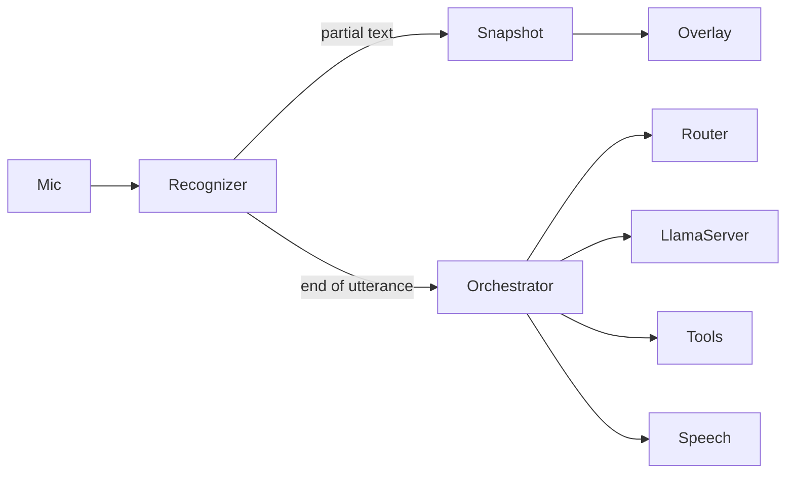

# Voice loop v2

This is the decision record. The implemented spec is [flow.md](flow.md). The audio stages are [audio.md](audio.md). The assistant listen path no longer waits on a silence timer or a Voxtype file.

The assistant currently waits on a silence timer, then on a Voxtype file. The next loop drops that timer. Words appear on the overlay while the person is still talking. Head selection and tools run only after the utterance is finished. Qwen on llama-server remains the tool model. One model that hears, speaks, and calls tools does not fit this machine.

## What goes away

On the assistant path only. F9 dictation keeps Voxtype.

- The endpointer: `silence_ms`, `min_speech_ms`, `start_timeout_ms`, `lead_in_ignore_ms`, energy thresholds, and Silero.
- `parec` as a second microphone client that decides a turn. The orb moves when partial words arrive. A level meter that never decides a turn is optional.
- Voxtype `record start`, `stop`, and `cancel`, and the wait on `prompt.txt`, for the assistant. The assistant and F9 no longer share the Voxtype state machine.
- The long transcribing phase.

Overlay, Snapshot, Orchestrator, Router, LlamaServer, Tools, and Kokoro for the finished sentence stay. Router and Tools do not run on a partial.

## Order

1. The microphone opens into one streaming recognizer. Partial text is written to Snapshot immediately. The overlay shows it. That is the acknowledgement, and it happens before classify or tools. Partials are replaced when the recognizer revises them. They are not turns. [ui-design.md](ui-design.md) already specifies that.
2. The orchestrator may hold the growing line. It does not call the router or any tool until the recognizer marks the utterance finished, or the user presses Enter.
3. The finished line is the user text. Head selection, the tool loop, and the Kokoro reply then run as they do now.
4. Escape still cancels. After a finished reply the session listens again and keeps the canvas.

Do not prefetch Jev or a tool call on a partial. A revision would classify the wrong sentence.

## One model is not enough here

[architecture.md](architecture.md) sizes the assistant for an RX 590 with 8 GB, and leaves that GPU for Whisper while Qwen3-4B runs in RAM at about 2.5 GB.

Qwen3-Omni-30B-A3B-Instruct is the model that takes audio, emits text, calls tools, and has a Talker for streaming speech. Qwen documents function calling on it. Official BF16 serving wants on the order of 79 GB for a short clip. A third-party Q4 estimate is about 19 GB, still above this GPU, and the Talker is not the llama-server path this repo uses. vLLM’s serve path for it is the Thinker, which is text out. It would replace LlamaServer, the reason for the router, and Kokoro, and it does not fit.

Qwen2.5-Omni 3B and 7B GGUF load in llama.cpp with audio input. Upstream llama.cpp does not generate that model’s audio. Tool calling is not the contract this loop uses. It would sit beside the 4B, not replace the pipeline.

Ultravox, Moshi, GLM-4-Voice, and Mini-Omni are speech in and speech out. They are turn-based and still use an external end-of-speech detector, or they do not call tools. BayLing-Duplex removes the detector with listen and speak tokens on a 9B GLM backbone. That is a research checkpoint, not this allowlist. MiniCPM-o through llama.cpp-omni streams audio in and speech out on a Qwen3-8B fork. It is not `agavai-llm`, and it is not the tool allowlist.

v2 is a cascade: a small streaming recognizer, then the same Qwen tool loop, then Kokoro. A single speech-and-tools model waits for another machine.

## Recognizer

The recognizer is Parakeet-Realtime-EOU-120M. The stages around it, including why a silence timer is not part of turn taking, are written in [audio.md](audio.md).

## Left open

Kokoro still speaks the finished reply. The live line on the overlay is the acknowledgement, not a spoken “mm-hmm” before the tools. The router still runs after the line is committed. Whether Jev is worth the network hop is a separate decision.
